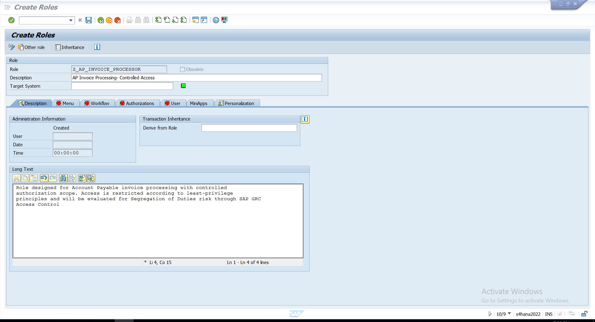

# 01 - Access Request & Role Design

## Business Requirement

I started the case by separating two Accounts Payable activities into different SAP roles instead of combining them into one broad access package.

The first role was created for invoice processing:

`Z_AP_INVOICE_PROCESSOR`

The purpose of the role was to provide controlled access for AP invoice processing while keeping the role narrow enough to support least-privilege and later SoD analysis.

The second business activity, payment processing, was kept separate so that the two responsibilities could be evaluated independently before looking at the combined access in SAP GRC.

---

## Invoice Processing Role

I created `Z_AP_INVOICE_PROCESSOR` in PFCG and documented the role with a clear business purpose.

The role description was:

**AP Invoice Processing - Controlled Access**

This gave the role a clear functional purpose instead of using a generic technical role name with no business context.

### Evidence



*Custom AP invoice-processing role created in PFCG with a defined business purpose.*

---

## Role Menu

I maintained the invoice-processing transaction in the role menu:

`FB60 - Enter Incoming Invoices`

I kept the role focused on invoice-processing activity rather than adding unrelated payment or administration access into the same role.

### Evidence


*FB60 maintained in the role menu for the AP invoice-processing role.*

---

## Role Design

The invoice-processing access was kept focused on the required business activity:

```text
Z_AP_INVOICE_PROCESSOR
└── FB60 - Enter Incoming Invoices
```

Payment processing was intentionally maintained separately rather than adding it to the same role.

This kept the role design clear and provided a controlled starting point for the authorization configuration in the next stage.
