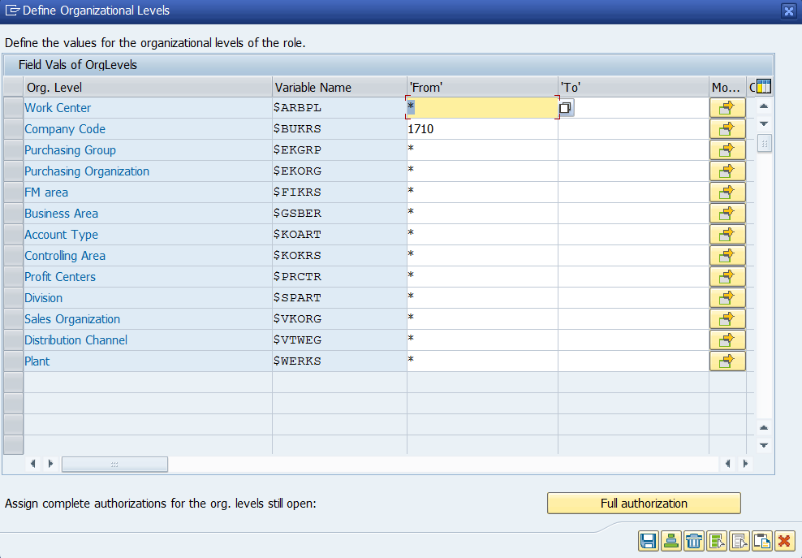
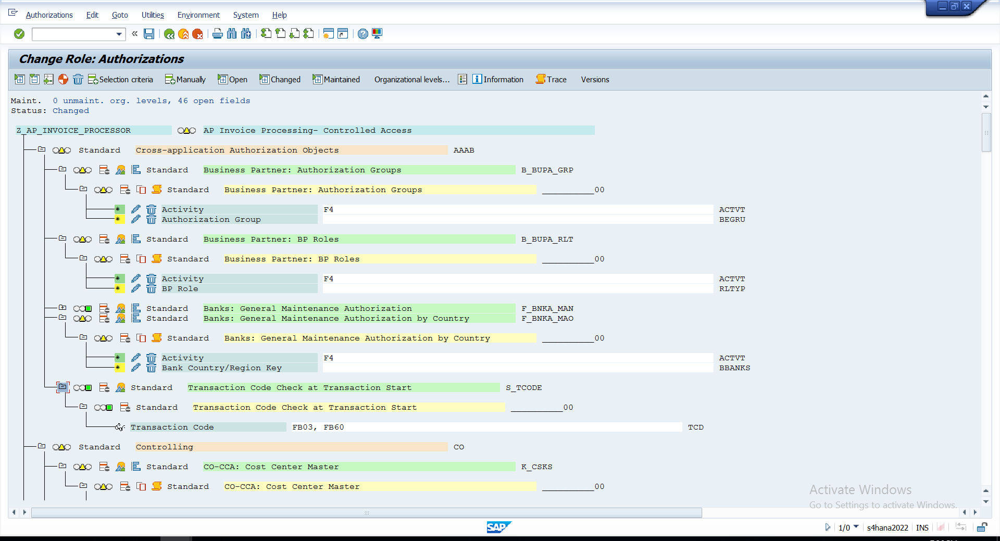
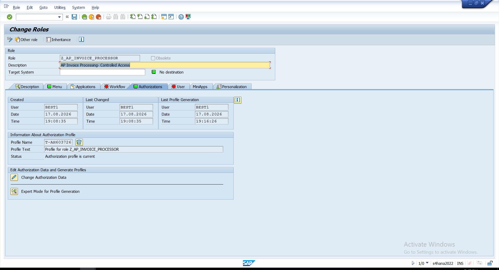

# 02 - Authorization Configuration

## Authorization Scope

After defining the invoice-processing role and adding `FB60`, I moved to the authorization configuration for `Z_AP_INVOICE_PROCESSOR`.

I did not leave the role at transaction-level access alone. I reviewed the authorization data behind the role and restricted the organizational scope before generating the profile.

---

## Organizational Level

I maintained the organizational values for the role and restricted the Company Code to:

`1710`

This limited the role to the required organizational scope instead of allowing unrestricted company-code access.

### Evidence



*Company Code 1710 maintained as part of the organizational-level restriction for the role.*

---

## Authorization Review

After maintaining the organizational values, I reviewed the authorization data generated for the role.

I checked the authorization objects, activity values, and organizational fields to make sure the access behind `FB60` was consistent with the role I was building.

I used this step to review the actual authorization scope rather than assuming that adding a transaction to the role menu was enough.

### Evidence



*Authorization data reviewed after maintaining the role and organizational values.*

---

## Profile Generation

Once the authorization values were maintained, I generated the authorization profile for `Z_AP_INVOICE_PROCESSOR`.

I confirmed that the authorization status was current after generation before moving forward with the user-side access.

### Evidence



*Authorization profile generated for the completed invoice-processing role configuration.*

---

## Configured Access

At the end of this step, the invoice-processing access was configured as:

```text
Z_AP_INVOICE_PROCESSOR
|
- FB60 - Enter Incoming Invoices
- Company Code - 1710
- Authorization values reviewed
- Authorization profile generated