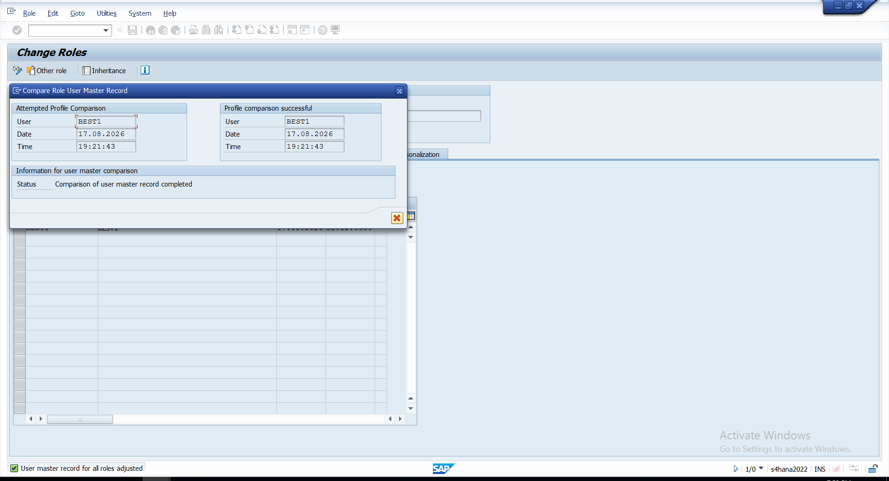
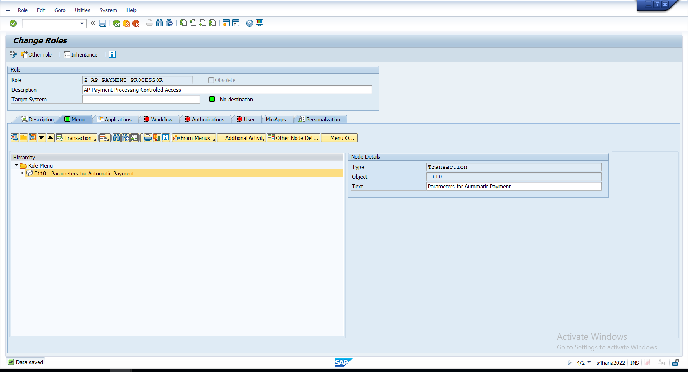
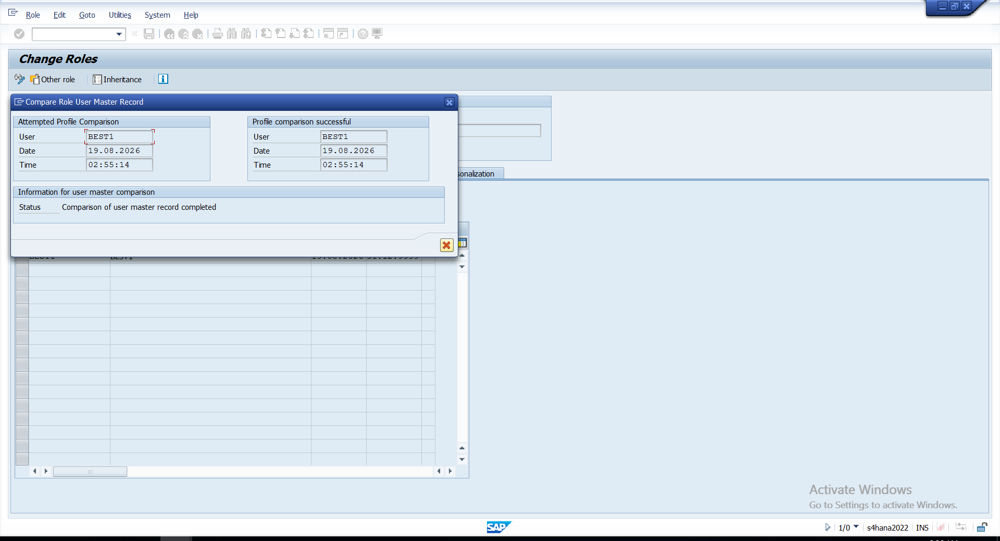

# 03 - User Provisioning & Payment Access

## User Provisioning

After completing the invoice-processing role, I ran user comparison so the role assignment was reflected in the user master.

The comparison completed successfully.

### Evidence

*User comparison completed successfully after the invoice-processing role was configured.*

---

## Payment Processing Access

Payment processing was kept in a separate role:

`Z_AP_PAYMENT_PROCESSOR`

The role included:

`F110 - Parameters for Automatic Payment`

I kept payment processing separate from invoice processing so the two responsibilities could be reviewed independently and then evaluated together through GRC.

### Evidence

*F110 maintained in the separate AP payment-processing role.*

---

## Payment Role User Comparison

After maintaining the payment role, I completed user comparison again.

The comparison completed successfully, confirming that the updated access was synchronized with the user master.

### Evidence

*Successful user comparison after the payment-processing role was maintained.*

---

## Access Before GRC Analysis

The access was now separated into two roles:

| Role | Access |
|---|---|
| `Z_AP_INVOICE_PROCESSOR` | `FB60 - Enter Incoming Invoices` |
| `Z_AP_PAYMENT_PROCESSOR` | `F110 - Parameters for Automatic Payment` |

Both roles were configured and synchronized successfully.

With the SAP role configuration complete, I moved to SAP GRC to review `BEST1` at the user level. The purpose of this analysis was to identify active SoD exposure in the user's effective access and investigate any resulting risk separately from the AP role-build evidence.