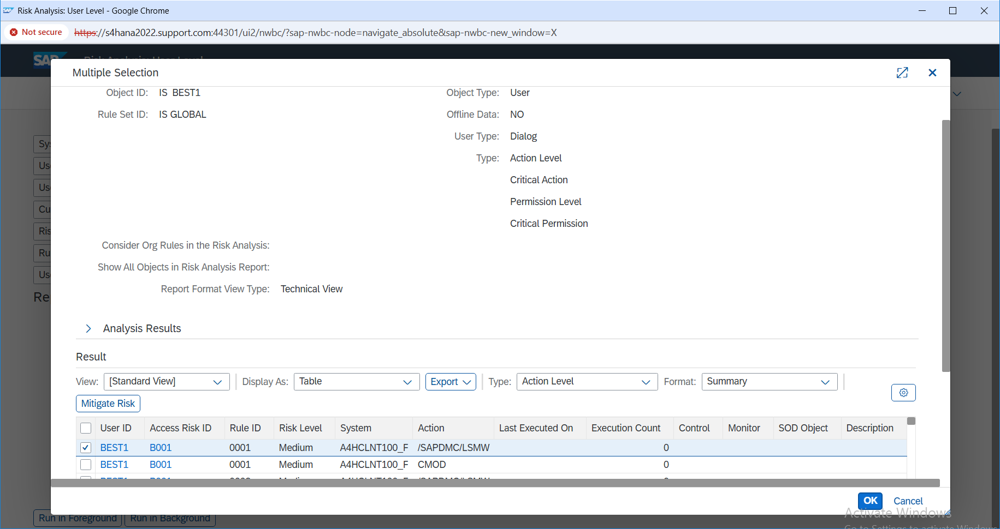
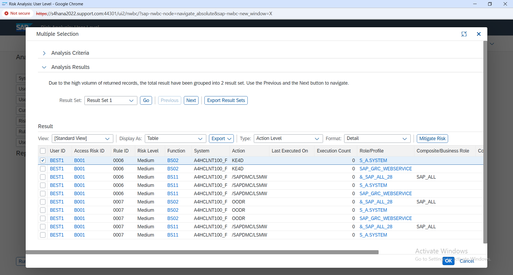

# 04 - SoD Risk Analysis

## User-Level Risk Analysis

After the access was configured, I ran User-Level Access Risk Analysis in SAP GRC for:

**User:** `BEST1`  
**Rule Set:** `GLOBAL`

The analysis returned an active SoD risk.

### Evidence



*User-level GRC analysis showing the B001 risk identified for BEST1.*

---

## Risk Identified

| Field | Result |
|---|---|
| Risk ID | `B001` |
| Risk Level | Medium |
| Risk Type | Segregation of Duties |
| Business Process | Basis |

The result included multiple rule and action combinations under the same risk.

This confirmed that the issue was not a single transaction. The user's effective access was matching different parts of the B001 rule.

---

## Action-Level Review

The result included actions such as:

- `/SAPDMC/LSMW`
- `CMOD`
- `DMCWB`
- `DMWB`
- `DSA`

Multiple rule IDs were also listed under B001.

I reviewed the action-level result instead of stopping at the risk ID because I needed to understand what access was actually contributing to the conflict.
---

## Technical Trace

I expanded the B001 result in the detailed technical view to trace the finding beyond the summary result.

The detailed output connected `BEST1` to B001 and showed the rule combinations, conflicting functions, individual actions, and Role/Profile values contributing to the analysis.

The result included actions such as:

- `/SAPDMC/LSMW`
- `CMOD`
- `DMCWB`
- `DMWB`
- `DSA`

This gave me a clearer view of how the user's effective access was being evaluated against the B001 rule rather than relying only on the overall risk count.

### Evidence



*Detailed B001 result showing the function, action, rule, and Role/Profile trace for BEST1.*

---

## Configured Access

At the end of the authorization configuration, the role contained the required transaction access and organizational restriction:

```text
Z_AP_INVOICE_PROCESSOR
├── FB60 - Enter Incoming Invoices
├── Company Code - 1710
├── Authorization values reviewed
└── Authorization profile generated
```

With the role configuration complete and the authorization profile generated, the next step was to synchronize the role assignment with the user master.

---

## Result

The user-level analysis identified `B001` as an active SoD finding for `BEST1`.

The detailed result showed the functions, actions, rule combinations, and Role/Profile values contributing to the finding. I treated B001 as a finding in BEST1's effective access rather than assuming that it was caused by the AP roles configured earlier in the project.

The next step was to review the B001 risk definition and confirm the functions configured on both sides of the conflict.
