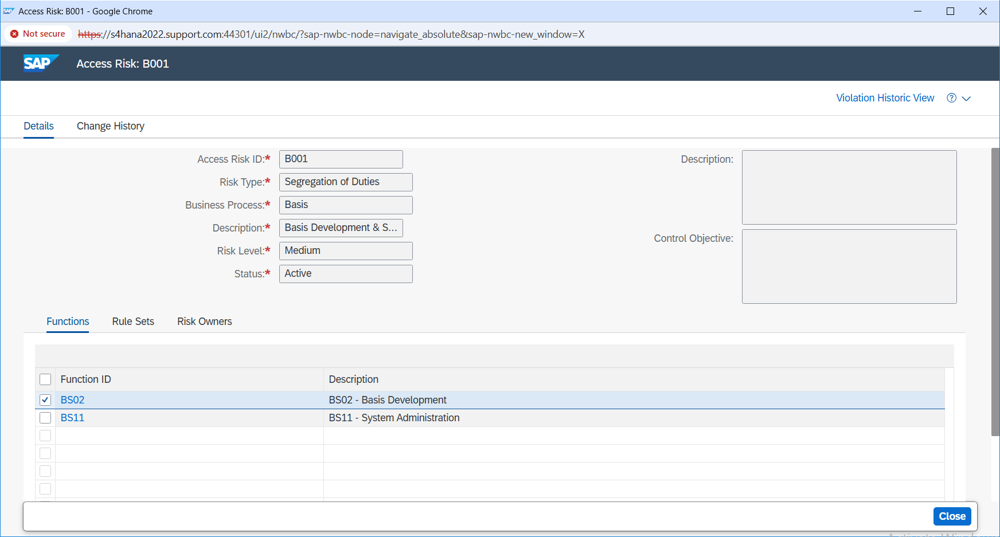

# 05 - Risk Investigation

## B001 Risk Detail

After B001 was identified in the user-level analysis, I opened the risk details to understand what was actually creating the conflict.

B001 was configured as a Segregation of Duties risk between:

- `BS02 - Basis Development`
- `BS11 - System Administration`

### Evidence

*B001 risk definition showing the conflict between Basis Development and System Administration.*

---

## Reviewing the Conflict

The user-level analysis had already shown multiple rule and action combinations under B001.

Opening the risk definition made the conflict clearer. The issue was the combination of development-related and system-administration capability under the same user access.

At this point, I did not treat every action listed by GRC as something that should automatically be removed.

The access needed to be checked against the user's actual responsibility first.

If one side of the conflict was not required, that access could be removed or redesigned.

If both functions were required, the conflict would still remain and would need a controlled risk-treatment decision.

---

## Access Review

The B001 finding was traced across both the detailed user-level result and the risk definition.

The detailed analysis showed the rule, function, action, and Role/Profile information associated with `BEST1`, while the risk definition confirmed the two functions configured in B001:

- `BS02 - Basis Development`
- `BS11 - System Administration`

Together, these results confirmed that B001 was being triggered by development-related and system-administration capabilities present in the user's effective access.

I did not treat the GRC output as a transaction-removal list. The access still needs to be evaluated against the user's actual responsibilities before deciding what should be removed, redesigned, or retained under additional control.

At this point, B001 was a confirmed SoD finding with enough technical detail to move into a risk-treatment decision.
